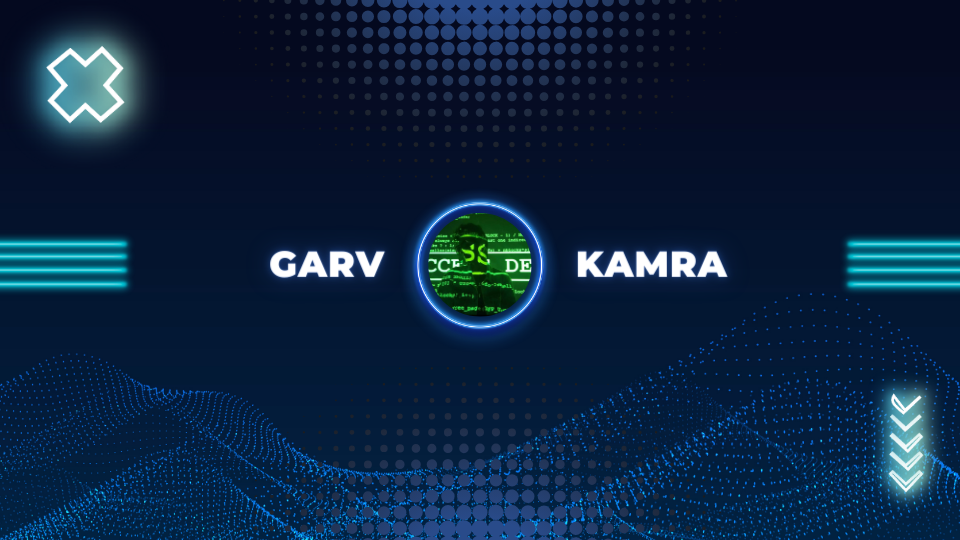

<!-- Your Banner -->

<!-- Your Introduction -->
### Hi there, I'm [Your Name]! 👋

I'm a third-year BCA student specializing in Cybersecurity, with a passion for exploring the intersections of technology, design, and education.

<!-- Your Interests -->
### 🌟 Interests

- 🛡️ Cybersecurity & Robotics
- 🎨 Graphic Design
- 🚀 Entrepreneurship & Education
- 💻 Front-end Development

<!-- About Me -->
### 📝 About Me

- 🔭 I'm currently diving deep into various operating systems like Kali Linux and Arch.
- 🎨 Crafting eye-catching visuals for events and social media is my forte.
- 🚀 I'm the founder of [NeevCode](www.neevcode.com), an e-learning platform empowering kids to explore high-end topics in a fun and accessible way.
- 💼 Proficient in front-end development, I blend technical expertise with design skills to create immersive user experiences.

<!-- Let's Connect -->
### 📫 Let's Connect

- 🌐 **Website:** [www.neevcode.com](www.neevcode.com)
- 📧 **Email:** [Your Email Address]
- 📱 **LinkedIn:** [Your LinkedIn Profile]

<!-- Your Stats -->
### 📊 GitHub Stats

